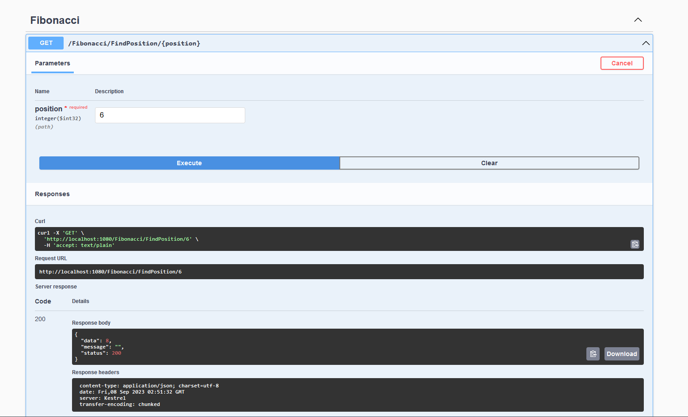

# Fibonacci App

*Language*

- C#

*Require*

- DotNet 6.0

*Usage*

For test use terminal

`First Step`

```bash
# Windows
cd {dirname}\Fibonacci

# MacOs / Linux
cd {dirname}/Fibonacci
```

`Second Step`

```bash
# Windows
dotnet run --project .\Fibonacci\

# MacOs / Linux
dotnet run --project ./Fibonacci/
```

`Go To` -> `https://localhost:7270/swagger/index.html` or `http://localhost:5187/swagger/index.html`



## Files

### Program.cs

```cs
// Main application.

...
// Inject service.
builder.Services.AddScoped<FibonacciService> ();
...

...
// Load Swagger
app.UseSwagger();
app.UseSwaggerUI();
...
```

### FibonacciController.cs

```cs
// A controller.
```

### FibonacciService.cs

```cs
// Fibonacci generator by position provided.

// serie:    0,1,1,2,3,5,8,13,21 ...
// position: 0,1,2,3,4,5,6,7 ,8  ...
int a = 0, b = 1, index = 0;

while (index < position)
{
    int temp = a;
    a = b;
    b = temp + b;
    index++;
}
```

## Publish

### For IIS

```bash
# Windows
dotnet build ".\Fibonacci/Fibonacci.csproj" -c Release -o .\build

# MacOs / Linux
dotnet build "./Fibonacci/Fibonacci.csproj" -c Release -o ./build
```

### Using Docker

```bash
docker compose up -d

# After publish.
http://{domain}:1080/swagger/index.html
```

### Using Azure, AWS, etc

```cs
// DevOps deploymet
```

**Another language or framework?, no problem**
